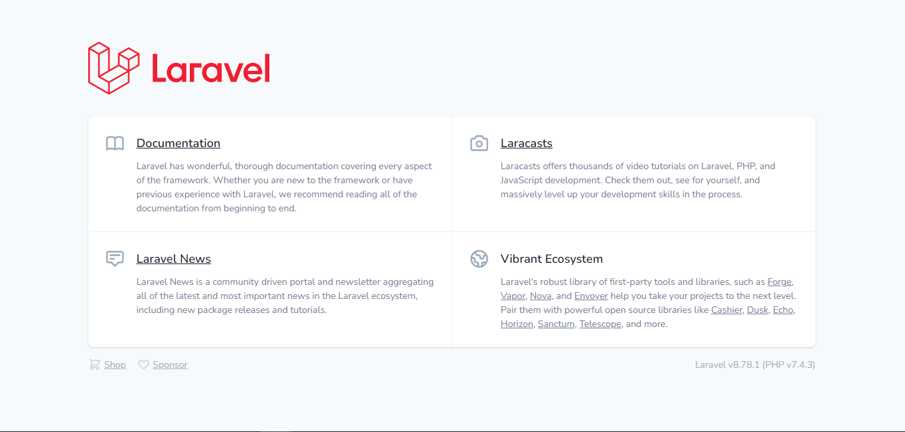

# Laravel Install

In this lab we will practice the installation of the Laravel.

Lab Goals:

* Install Laravel step by step

### STEP 1) Updating the System


```bash
  sudo apt update -y && apt upgrade -y
```

### STEP 2) Install PHP

```bash
  sudo apt install software-properties-common
```

```bash
  sudo add-apt-repository ppa:ondrej/php
```

Install PHP.
```bash
  sudo apt-get install php8.1-cgi php8.1-cli
```

Verify if PHP is installed.

```bash
  php -v
```

```bash
  Output:
  PHP 7.4.3 (cli) (built: Nov 25 2021 23:16:22) ( NTS )
  Copyright (c) The PHP Group
  Zend Engine v3.4.0, Copyright (c) Zend Technologies
```


### STEP 3) Install Composer

Composer is a package manager for PHP that provides a standard format for managing dependencies of PHP software and required libraries. 

To install composer follow the steps below.

```bash
  sudo apt update
```

```bash
  cd ~
  curl -sS https://getcomposer.org/installer -o /tmp/composer-setup.php
```

Next, we’ll verify that the downloaded installer matches the SHA-384 hash for the latest installer found on the Composer Public Keys / Signatures page

```bash
  HASH=`curl -sS https://composer.github.io/installer.sig
````

Now execute the following PHP code, as provided in the Composer download page, to verify that the installation script is safe to run:


```bash
    php -r "if (hash_file('SHA384', '/tmp/composer-setup.php') === '$HASH') { echo 'Installer verified'; } else { echo 'Installer corrupt'; unlink('composer-setup.php'); } echo PHP_EOL;"
```
```bash
  Output:
    Installer verified
```
```bash
  sudo php /tmp/composer-setup.php --install-dir=/usr/local/bin --filename=composer
```
```bash
  Output:
  All settings correct for using Composer
  Downloading...

  Composer (version 2.2.9) successfully installed to: /usr/local/bin/composer
  Use it: php /usr/local/bin/composer
```

Verify the installation.
```bash
  composer
```
```bash
  Output:
     ______
  / ____/___  ____ ___  ____  ____  ________  _____
 / /   / __ \/ __ `__ \/ __ \/ __ \/ ___/ _ \/ ___/
/ /___/ /_/ / / / / / / /_/ / /_/ (__  )  __/ /
\____/\____/_/ /_/ /_/ .___/\____/____/\___/_/
                    /_/
Composer version Composer version 2.2.9 2022-03-15 22:13:37
Usage:
  command [options] [arguments]

Options:
  -h, --help                     Display this help message
  -q, --quiet                    Do not output any message
  -V, --version                  Display this application version
      --ansi                     Force ANSI output
      --no-ansi                  Disable ANSI output
  -n, --no-interaction           Do not ask any interactive question
      --profile                  Display timing and memory usage information
      --no-plugins               Whether to disable plugins.
  -d, --working-dir=WORKING-DIR  If specified, use the given directory as working directory.
      --no-cache                 Prevent use of the cache
  -v|vv|vvv, --verbose           Increase the verbosity of messages: 1 for normal output, 2 for more verbose output and 3 for debug
...
```
### STEP 4) Install the Laravel Framework

Install the Laravel framework using composer.
```bash
  composer create-project laravel/laravel course
```
```bash
 Output:

  Package manifest generated successfully.
  77 packages you are using are looking for funding.
  Use the `composer fund` command to find out more!
  > @php artisan vendor:publish --tag=laravel-assets --ansi --force
  No publishable resources for tag [laravel-assets].
  Publishing complete.
  > @php artisan key:generate --ansi
  Application key set successfully.
```
Check the Laravel version. First go to your course folder.
```bash
  cd course
```
```bash
  php artisan serve
```



