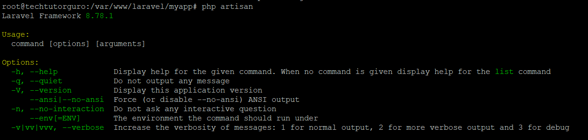

# Laravel Install

In this lab we will practice the installation of the Laravel.

Lab Goals:

* Install Laravel step by step

### STEP 1) Updating the System


```bash
  sudo apt update -y && apt upgrade -y
```

### STEP 2) Install PHP and PHP extensions

Install PHP and PHP extensions needed to run the Laravel Framework.
```bash
  sudo apt-get install php libapache2-mod-php php-dev php-zip php-curl php-pear php-mbstring php-mysql php-gd php-xml curl -y
```

Verify if PHP is installed.

```bash
  php -v
```

```bash
  Output:
  PHP 7.4.3 (cli) (built: Nov 25 2021 23:16:22) ( NTS )
  Copyright (c) The PHP Group
  Zend Engine v3.4.0, Copyright (c) Zend Technologies
```


### STEP 3)  Install Apache Web Server

To install the Apache web server run the following.
```bash
  sudo apt install apache2
```

Let us start and enable Apache.
```bash
  sudo systemctl start apache2
``````
```bash
  sudo systemctl enable apache2
```
### STEP 4) Creating Database for our Laravel App

Our environment is on a LAMP stack we will use MariaDB as a database system. But you can choose different database system as Laravel supports wide variety of database systems like SQLite, MySQL, Postgres, and SQL Server.

Let us install MariaDB.
```bash
  sudo apt install mariadb-server
```

Login to your MariaDB server.
```bash
  sudo mysql -u root -p
```

Create the database for our Laravel app.
```bash
  MariaDB [(none)]> create database laravel;
  MariaDB [(none)]> grant all privileges on laravel.* to 'laravel'@'localhost' identified by 'mypassword';
  MariaDB [(none)]> flush privileges;
  MariaDB [(none)]> exit;
```
### STEP 5)Install Composer

Composer is a package manager for PHP that provides a standard format for managing dependencies of PHP software and required libraries. 

To install composer follow the steps below.

```bash
  curl -sS https://getcomposer.org/installer | php
```

```bash
  sudo mv composer.phar /usr/local/bin/composer
```

```bash
  sudo chmod +x /usr/local/bin/composer
```
Verify the installation.
```bash
  composer --version
```
```bash
  Output:
  Composer version 2.2.3 2021-12-31 12:18:53
```
### STEP 6) Install the Laravel Framework
First let us create a project directory.
```bash
  sudo mkdir /var/www/laravel
```

Let us change directory to our project directory.
```bash
  cd /var/www/laravel
```

Install the Laravel framework using composer.
```bash
  composer create-project laravel/laravel myapp --prefer-dist
```
```bash
 Output:

  Package manifest generated successfully.
  77 packages you are using are looking for funding.
  Use the `composer fund` command to find out more!
  > @php artisan vendor:publish --tag=laravel-assets --ansi --force
  No publishable resources for tag [laravel-assets].
  Publishing complete.
  > @php artisan key:generate --ansi
  Application key set successfully.
```
Check the Laravel version. First go to your myapp.
```bash
  cd myapp
```
```bash
  php artisan
```


#### Fix the permission of our project directory.

Set the owner to www-data(Apache user).
```bash
  sudo chown -R www-data:www-data /var/www/laravel
```

Set all directories to 755 permission.
```bash
 sudo find /var/www/laravel/ -type d -exec chmod 755 {} \;
```

Set all files to 644 permission.
```bash
  sudo find /var/www/wordpress/ -type f -exec chmod 644 {} \;
```


### STEP 7) Create Virtual Host for our Laravel App

Let us create a virtual host.

```bash
  nano /etc/apache2/sites-available/laravel.conf
```

```bash
  <VirtualHost *:80>
     ServerAdmin admin@domain.com
     DocumentRoot /var/www/laravel/myapp/public
     ServerName domain.com


     ErrorLog ${APACHE_LOG_DIR}/error.log
     CustomLog ${APACHE_LOG_DIR}/access.log combined

     <Directory /var/www/laravel/>
        Options +FollowSymlinks
        AllowOverride All
        Require all granted
     </Directory>

  </VirtualHost>

```
Note: Don’t forget to change the domain in the ServerName directive.

Save the file and exit.

Let us enable the laravel virtual host.
```bash
  sudo a2ensite laravel.conf
```

Also enable the Apache mod_rewrite.
```bash
  sudo a2enmod rewrite
```

Restart the Apache web server.
```bash
  sudo systemctl restart apache2
```

### STEP 8) Access Laravel App

You have successfully configured your Laravel application. You can check it by accessing the domain set on your virtual host. Open your browser and type your domain e.g http://doamin.com.


If you want to secure your site and install SSL certificate.
